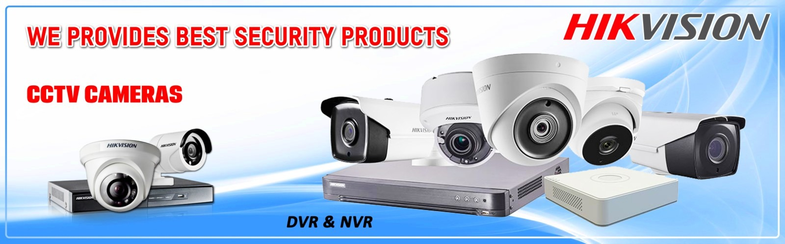
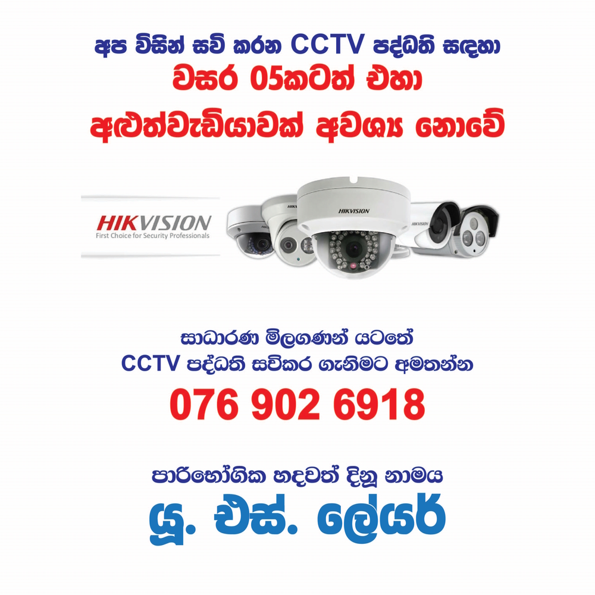

You can get our reliable service in Hapugala, Wakwella, Baddegama, Poddala, Dodanduwa, Hikkaduwa, Bataduwa, Ahangama, Koggala, Habaraduwa, Wanduramba, Labuduwa, Karapitiya, Kalegana, Beligaha and many other areas in Galle district.

### Why do you need CCTV?
Video surveillance systems(CCTV) protect private property, offices, shops, etc. from various encroachments, burglaries, thefts and other offenses. Even non-functioning cameras have a deterrent effect on offenders, thereby ensuring the safety of objects of observation.

### How to get professional CCTV guide?
Call now: <a href="tel:=+94769026918">+94 76 902 6918</a>

<section class="py-5 text-center container">
    

      

        <h1 class="fw-light">Are you looking for CCTV shop in Galle?</h1>
        
You should contact us for hikvision products

        

          <a href="tel:=+94769026918" class="btn btn-primary my-2">+94 76 902 6918</a>
        

      

    

</section>

